# Java 项目结构工程文档

## 1. 项目概述

本项目是 Java Spring Boot 实现的洞察分析后端服务，为陆控仪表盘提供数据库指标读取、事实包组装、LLM 结构化分析、结果存储和前端展示能力。当前版本保留部分历史接口，同时新增 `/api/insights/*` 作为数据库驱动的标准分析链路。

### 1.1 项目定位

| 属性 | 值 |
| :--- | :--- |
| 项目名称 | dashboard |
| 所属组织 | com.lufax |
| 版本 | 1.0.0 |
| 技术栈 | Java 8 + Spring Boot 1.5.9 + MyBatis + PostgreSQL |
| 原项目 | Python FastAPI |

### 1.2 核心功能

- **仪表盘洞察生成**：根据核心指标和维度数据生成 AI 洞察
- **卡片洞察生成**：针对特定卡片生成定制化洞察
- **场景洞察生成**：支持多场景的深度分析和根因定位
- **数据库事实包组装**：从指标、卡片绑定和情景基线表拉取数据并构建 LLM 输入 JSON
- **AI 研判展示**：卡片红绿灯、分析标签和经营计算器默认三情景结果由 LLM 响应提供
- **来源可追溯**：演示初始化数据通过接口和页面明确标识为“演示数据，待替换”
- **异步任务管理**：支持批量洞察任务的异步处理
- **规则引擎**：基于规则的异常检测和评分

---

## 2. 技术栈

### 2.1 核心技术

| 分类 | 技术 | 版本 | 说明 |
| :--- | :--- | :--- | :--- |
| 语言 | Java | 1.8 | 编程语言 |
| 框架 | Spring Boot | 1.5.9.RELEASE | Web 应用框架 |
| ORM | MyBatis | 1.3.5 | 数据访问框架 |
| 数据库 | PostgreSQL | 42.2.25 | 关系型数据库 |
| JSON 验证 | json-schema-validator | 1.0.72 | JSON Schema 验证 |

### 2.2 依赖说明

```xml
<!-- Spring Boot Web -->
<dependency>
    <groupId>org.springframework.boot</groupId>
    <artifactId>spring-boot-starter-web</artifactId>
</dependency>

<!-- MyBatis -->
<dependency>
    <groupId>org.mybatis.spring.boot</groupId>
    <artifactId>mybatis-spring-boot-starter</artifactId>
    <version>1.3.5</version>
</dependency>

<!-- PostgreSQL -->
<dependency>
    <groupId>org.postgresql</groupId>
    <artifactId>postgresql</artifactId>
    <version>42.2.25</version>
</dependency>

<!-- JSON Schema Validator -->
<dependency>
    <groupId>com.networknt</groupId>
    <artifactId>json-schema-validator</artifactId>
    <version>1.0.72</version>
</dependency>
```

---

## 3. 项目结构

### 3.1 目录结构

```
pom.xml                                      # Maven 构建及前端静态资源打包配置
lufax_dashboard3.html                       # 经营看板页面，消费 AI 卡片结果
ai_insights.html                            # AI 洞察及经营计算器页面
src/main/
    ├── java/
    │   └── com/
    │       └── lufax/
    │           └── dashboard/
    │               ├── DashboardApplication.java    # 应用入口
    │               ├── config/                      # 配置类
    │               │   ├── AsyncConfig.java         # 异步线程池配置
    │               │   ├── LlmConfig.java          # LLM 适配器配置
    │               │   ├── MyBatisConfig.java       # MyBatis 配置
    │               │   └── WebMvcConfig.java        # Web MVC 配置
    │               ├── controller/                   # REST API 控制器
    │               │   ├── CardController.java      # 卡片 API
    │               │   ├── DashboardController.java # 仪表盘 API
    │               │   ├── InsightController.java   # 数据库驱动的 AI 页面状态/情景 API
    │               │   ├── JobController.java       # 任务 API
    │               │   ├── ScenarioController.java  # 场景 API
    │               │   └── UploadController.java    # 上传 API
    │               ├── service/                     # 业务服务层
    │               │   ├── DemoSeedImportService.java # 演示业务表初始化
    │               │   ├── FactPackService.java     # 表数据读取与事实包组装
    │               │   ├── FactBuilderService.java  # 历史兼容事实构建服务
    │               │   ├── InsightService.java      # LLM 调用、校验、缓存及持久化
    │               │   ├── InsightJobService.java   # 任务管理服务
    │               │   └── RuleEngineService.java   # 规则引擎服务
    │               ├── llm/                         # LLM 适配器层
    │               │   ├── LlmAdapter.java          # 适配器接口
    │               │   ├── MockLlmAdapter.java      # Mock 适配器
    │               │   └── ExternalLlmAdapter.java  # 外部 LLM 适配器
    │               ├── repository/                  # 数据访问层
    │               │   ├── BusinessFactMapper.java  # 业务事实与情景基线读写
    │               │   ├── InsightResultMapper.java
    │               │   ├── InsightJobMapper.java
    │               │   └── InsightJobItemMapper.java
    │               ├── model/                       # 数据模型
    │               │   ├── entity/                  # 数据库实体
    │               │   │   ├── MetricSnapshot.java
    │               │   │   ├── BusinessMetric.java
    │               │   │   ├── CardDefinition.java
    │               │   │   └── ScenarioBaseline.java
    │               │   ├── request/                 # 请求对象
    │               │   ├── response/                # 响应对象
    │               │   └── dto/                     # 数据传输对象
    │               └── util/                        # 工具类
    │                   ├── HashUtils.java           # 哈希工具
    │                   ├── JsonUtils.java           # JSON 工具
    │                   ├── ResourceUtils.java        # 资源加载工具
    │                   ├── TimeUtils.java           # 时间工具
    │                   └── ValidationUtils.java     # 验证工具
    └── resources/
        ├── application.properties                   # 应用配置
        ├── application-demo.properties              # H2 演示运行配置
        ├── sql/                                    # SQL 脚本
        │   ├── init_postgres.sql                   # 生产 PostgreSQL 表结构
        │   └── init_h2.sql                         # 本地演示 H2 表结构
        ├── mapper/                                 # MyBatis 映射文件
        │   ├── BusinessFactMapper.xml              # 业务指标读取 SQL
        │   └── InsightResultMapper.xml             # AI 结果读写 SQL
        ├── prompts/                                # 提示词模板
        ├── schemas/                                # JSON Schema
        └── data/                                   # 演示初始化配置数据
src/test/
    ├── java/com/lufax/dashboard/                  # Java 回归测试
    │   ├── repository/BusinessFactMapperTest.java # 业务事实表读写验证
    │   ├── service/FactPackServiceTest.java       # 事实包字段验证
    │   ├── service/DatabaseBackedInsightServiceTest.java # LLM 链路/缓存验证
    │   └── controller/InsightControllerTest.java  # 页面状态接口验证
    └── resources/
        ├── application-test.properties            # 测试运行配置
        └── schema-test.sql                        # H2 测试表结构
```

### 3.2 模块职责说明

| 模块 | 职责 | 说明 |
| :--- | :--- | :--- |
| **config** | 配置类 | Spring 配置，包括线程池、MyBatis、CORS 等 |
| **controller** | REST API | 对外暴露的 HTTP 接口，处理请求和响应 |
| **service** | 业务逻辑 | 数据入表、事实包构建、洞察生成、结果持久化和任务管理 |
| **llm** | LLM 适配 | 对接外部或 Mock LLM 服务 |
| **repository** | 数据访问 | 业务事实、情景基线、模型结果及任务数据的 MyBatis Mapper |
| **model** | 数据模型 | 实体、请求、响应、DTO 对象 |
| **util** | 工具类 | 通用工具方法 |

---

## 4. 核心模块说明

### 4.1 控制器层 (Controller)

| 控制器 | 路径 | 功能 |
| :--- | :--- | :--- |
| DashboardController | `/api/*` | 健康检查、数据库指标查询及兼容仪表盘洞察入口 |
| InsightController | `/api/insights/*` | 页面一次性状态、整体洞察、计算器情景分析和同步任务兼容入口 |
| CardController | `/api/card/*` | 卡片洞察、配置管理、手动覆盖 |
| ScenarioController | `/api/scenario/*` | 场景洞察、场景列表 |
| JobController | `/api/job/*` | 任务创建、状态查询、取消、删除 |
| UploadController | `/api/upload/*` | Excel 上传、数据上传 |

### 4.2 服务层 (Service)

#### 4.2.1 DemoSeedImportService
- **职责**：正式源表尚未接入时，将演示 JSON 首次导入标准业务表。
- **输入资源**：`data/dashboard_metrics_mock.json`、`data/card_config.json`。
- **写入表**：`metric_snapshot`、`business_metric`、`scenario_baseline`、`card_definition`、`card_metric_binding`。
- **来源标识**：写入 `source_type=DEMO_SEED`、`source_label=演示数据，待替换`；通过 `app.demo-seed.enabled` 控制是否执行。

#### 4.2.2 FactPackService
- **职责**：标准分析路径的事实获取服务，只从数据库业务表读取数据并组装为待提交 LLM 的 `FACT_PACK`。
- **方法**：
  - `buildCardFactPack(period, cardId)` - 根据卡片指标绑定拉取该卡片相关指标。
  - `buildDashboardFactPack(period)` - 拉取当前快照的核心指标和分群指标。
  - `buildScenarioFactPack(period, scenario, overrides)` - 读取情景基线输入、叠加用户调参并附带业务指标。

#### 4.2.3 InsightService
- **职责**：按分析类型加载提示词、调用 LLM、校验 AI 必须返回的结论字段并持久化结果。
- **方法**：
  - `generateDashboardInsight()` - 生成仪表盘洞察
  - `generateCardInsight()` - 生成卡片洞察
  - `generateScenarioInsight()` - 生成场景洞察
  - `persistResult()` - 保存事实包、模型原始响应、结构化结果及 AI 标签/红绿灯
- **缓存键**：`period + metric_version + prompt_version + insight_type + card_id`；情景分析的 `card_id` 含事实包哈希片段，用户调参后不会错误复用默认结果。

#### 4.2.4 InsightJobService
- **职责**：异步任务管理服务
- **方法**：
  - `createJob()` - 创建任务
  - `processJobAsync()` - 异步处理任务
  - `getJobStatus()` - 查询任务状态
  - `cancelJob()` - 取消任务

#### 4.2.5 RuleEngineService
- **职责**：规则引擎服务
- **方法**：
  - `loadRules()` - 加载规则配置
  - `evaluate()` - 规则评估
  - `computeScenarioHash()` - 计算场景哈希

#### 4.2.6 FactBuilderService
- **职责**：历史兼容事实构建服务；新数据库到 LLM 标准路径使用 `FactPackService`。
- **方法**：
  - `buildCoreMetric()` - 构建核心指标
  - `buildDimensionScores()` - 构建维度评分
  - `buildCrossSignals()` - 构建交叉信号
  - `buildFactPayload()` - 构建事实负载

### 4.3 LLM 适配器层

| 适配器 | 说明 |
| :--- | :--- |
| LlmAdapter | 适配器接口定义 |
| MockLlmAdapter | Mock 模式，返回模拟数据 |
| ExternalLlmAdapter | 外部 LLM 服务适配，支持 PAIC / OpenAI 双协议 |

### 4.4 数据模型

#### 4.4.1 Entity（数据库实体）

| 实体 | 对应表 | 说明 |
| :--- | :--- | :--- |
| MetricSnapshot | metric_snapshot | 业务数据快照版本及来源追溯 |
| BusinessMetric | business_metric | 核心/分群业务指标事实 |
| CardDefinition | card_definition | 分析卡片定义 |
| ScenarioBaseline | scenario_baseline | 三种经营计算器情景输入基线 |
| InsightResult | insight_result | LLM 输入事实包及结构化结果 |
| InsightJob | insight_job | 任务主表 |
| InsightJobItem | insight_job_item | 任务子项 |

#### 4.4.2 Request（请求对象）

| 请求对象 | 用途 |
| :--- | :--- |
| DashboardInsightRequest | 仪表盘洞察请求 |
| CardInsightRequest | 卡片洞察请求 |
| ScenarioInsightRequest | 场景洞察请求 |
| CreateJobRequest | 创建任务请求 |
| ManualOverrideRequest | 手动覆盖请求 |
| UploadExcelRequest | 上传请求 |

#### 4.4.3 Response（响应对象）

| 响应对象 | 用途 |
| :--- | :--- |
| DashboardDataResponse | 仪表盘数据响应 |
| CreateJobResponse | 创建任务响应 |
| HealthResponse | 健康检查响应 |
| ManualOverrideResponse | 手动覆盖响应 |
| UploadExcelResponse | 上传响应 |

#### 4.4.4 DTO（数据传输对象）

| DTO | 用途 |
| :--- | :--- |
| CoreMetricDto | 核心指标 |
| DimensionScoreDto | 维度评分 |
| CrossSignalDto | 交叉信号 |
| RootCauseDto | 根因分析 |
| CardConfigDto | 卡片配置 |
| JobStatusDto | 任务状态 |
| RulesDto | 规则配置 |

---

## 5. API 接口列表

### 5.1 Dashboard API

| 方法 | 路径 | 功能 |
| :--- | :--- | :--- |
| GET | `/api/health` | 健康检查 |
| POST | `/api/dashboard/insight` | 生成仪表盘洞察 |
| GET | `/api/dashboard/data?scenario={scenario}&metric_date={period}` | 从数据库读取指标、来源、卡片与默认情景数据 |
| GET | `/api/dashboard/mock` | 获取 Mock 数据 |
| GET | `/api/insights/{id}` | 查询洞察详情 |
| GET | `/api/insights` | 查询洞察列表 |
| DELETE | `/api/insights/{id}` | 删除洞察 |

### 5.2 数据库驱动 AI 页面 API（标准链路）

| 方法 | 路径 | 功能 | 输出重点 |
| :--- | :--- | :--- | :--- |
| GET | `/api/insights/page-state?period={period}` | 返回页面所需的全部 AI 结果 | `data_source`、`cards`、`dashboard`、`scenarios` |
| GET | `/api/insights/dashboard?period={period}` | 生成/读取总体经营分析 | `overall_traffic_light`、`analysis_labels` |
| POST | `/api/insights/scenario` | 按当前真实指标及用户输入生成情景分析 | `inputs`、`projected_net_profit`、`traffic_light` |
| POST | `/api/insights/jobs` | 页面刷新兼容入口，同步执行一次分析生成 | `job_id`、`status` |
| GET | `/api/insights/jobs/{jobId}` | 查询兼容任务状态 | `status` |

### 5.3 Card API

| 方法 | 路径 | 功能 |
| :--- | :--- | :--- |
| POST | `/api/card/insight` | 生成卡片洞察 |
| GET | `/api/card/config` | 获取卡片配置 |
| GET | `/api/card/config/all` | 获取所有卡片配置 |
| POST | `/api/card/override` | 手动覆盖洞察 |

### 5.4 Scenario API

| 方法 | 路径 | 功能 |
| :--- | :--- | :--- |
| POST | `/api/scenario/insight` | 生成场景洞察 |
| GET | `/api/scenario/list` | 获取场景列表 |
| GET | `/api/scenario/{scenario}` | 获取场景信息 |

### 5.5 Job API

| 方法 | 路径 | 功能 |
| :--- | :--- | :--- |
| POST | `/api/job/create` | 创建异步任务 |
| GET | `/api/job/status/{job_id}` | 查询任务状态 |
| POST | `/api/job/cancel/{job_id}` | 取消任务 |
| DELETE | `/api/job/{job_id}` | 删除任务 |
| GET | `/api/job/list` | 查询任务列表 |

### 5.6 Upload API

| 方法 | 路径 | 功能 |
| :--- | :--- | :--- |
| POST | `/api/upload/excel` | 上传 Excel 文件 |
| POST | `/api/upload/data` | 上传数据 |

---

## 6. 配置说明

### 6.1 application.properties 关键配置

```properties
# 服务器配置
server.port=8000

# 数据库配置
spring.datasource.url=jdbc:postgresql://localhost:5432/dashboard
spring.datasource.username=postgres
spring.datasource.password=postgres

# MyBatis 配置
mybatis.mapper-locations=classpath:mapper/*.xml
mybatis.type-aliases-package=com.lufax.dashboard.model
mybatis.configuration.map-underscore-to-camel-case=true

# LLM 配置
llm.adapter=mock                          # mock 或 external
llm.api.key=your-api-key                  # 外部 LLM API Key
llm.base.url=https://api.openai.com/v1    # LLM 服务地址
llm.model=gpt-4                           # 模型名称
llm.concurrency=2                         # 并发数限制

# 应用配置
app.default-period=2026-03-YTD
app.prompt-version=v2
app.job-timeout-seconds=600
app.demo-seed.enabled=true
```

### 6.2 配置说明

| 配置项 | 说明 | 默认值 |
| :--- | :--- | :--- |
| server.port | 服务端口 | 8000 |
| spring.datasource.url | 数据库连接地址 | jdbc:postgresql://localhost:5432/dashboard |
| llm.adapter | LLM 适配器类型 (mock / external) | mock |
| llm.protocol | LLM 协议类型 (paic / openai) | paic |
| llm.concurrency | LLM 并发数限制 | 2 |
| llm.paic.appId | PAIC 应用 ID | ZHJYPT |
| llm.paic.botId | PAIC 机器人 ID | 1089944 |
| app.job-timeout-seconds | 任务超时时间（秒） | 600 |
| app.default-period | 默认读取及分析期间 | 2026-03-YTD |
| app.prompt-version | 分析提示词/缓存版本 | v2 |
| app.demo-seed.enabled | 无正式源表时是否导入演示事实数据 | true |

---

## 7. 数据库设计

### 7.1 数据库表

#### 7.1.1 metric_snapshot 表

| 字段名 | 类型 | 约束 | 说明 |
| :--- | :--- | :--- | :--- |
| id | BIGSERIAL | PRIMARY KEY | 主键 |
| period | VARCHAR(40) | NOT NULL | 指标期间 |
| metric_version | VARCHAR(80) | NOT NULL | 本批业务事实版本 |
| source_type | VARCHAR(30) | NOT NULL | 来源类型；当前演示为 `DEMO_SEED` |
| source_label | VARCHAR(100) | NOT NULL | 页面可展示来源；当前为“演示数据，待替换” |
| source_file | VARCHAR(200) | | 初始化来源文件 |
| imported_at | TIMESTAMP | | 入库时间 |

#### 7.1.2 business_metric 表

| 字段名 | 类型 | 约束 | 说明 |
| :--- | :--- | :--- | :--- |
| period, metric_version | VARCHAR | NOT NULL | 关联当前指标快照 |
| metric_scope | VARCHAR(20) | NOT NULL | `core` 或 `segment` |
| metric_code, metric_name | VARCHAR | | 指标代码与名称 |
| module, dimension_key, segment | VARCHAR | | 模块及分群定位 |
| metric_value, display_value, unit | 数值/字符 | | 指标数值及展示格式 |
| yoy, mom, budget, budget_gap | DOUBLE PRECISION | | 趋势及预算比较事实 |
| redline, yellowline, distance_to_redline | DOUBLE PRECISION | | 判断所需阈值事实 |
| source_status | VARCHAR(20) | | 原数据历史状态，仅保留追溯，不提交为 AI 结论 |
| product_type, channel_type, customer_type, vintage, mob | VARCHAR | | 细分维度 |

#### 7.1.3 card_definition 与 card_metric_binding 表

| 表 | 主要字段 | 用途 |
| :--- | :--- | :--- |
| card_definition | `card_id`, `title`, `module`, `prompt_version` | 定义前端分析卡片 |
| card_metric_binding | `card_id`, `metric_code` | 定义每张卡片应抽取哪些业务指标 |

#### 7.1.4 scenario_baseline 表

| 字段名 | 类型 | 说明 |
| :--- | :--- | :--- |
| period, metric_version | VARCHAR | 对应指标快照 |
| scenario | VARCHAR(20) | `bear`、`base`、`bull` |
| scenario_label | VARCHAR(80) | 情景展示名称 |
| inputs_json | TEXT | 情景基础输入，分析时可由页面提交值覆盖 |

#### 7.1.5 insight_result 表

| 字段名 | 类型 | 约束 | 说明 |
| :--- | :--- | :--- | :--- |
| id | SERIAL | PRIMARY KEY | 主键 |
| period, metric_version, prompt_version | TEXT | NOT NULL | 数据与提示词版本 |
| insight_type | TEXT | NOT NULL | `card`、`dashboard` 或 `scenario` |
| card_id | TEXT | NOT NULL | 卡片键；情景场景使用带事实包哈希的缓存键 |
| status | TEXT | NOT NULL | 生成状态 |
| raw_fact_pack_json | TEXT | | 实际提交模型的业务事实 JSON |
| raw_llm_output, raw_llm_output_json | TEXT | | 模型原始输出 |
| schema_name | TEXT | | 响应结构协议名称 |
| traffic_light | TEXT | | AI 返回的红黄绿结果 |
| analysis_labels_json | TEXT | | AI 返回的标签数组 |
| result_json | TEXT | | 补充来源、版本后的完整响应 |
| validated | BOOLEAN | | 是否已通过服务端必需字段检查 |

### 7.2 索引设计

| 表名 | 索引字段 | 类型 |
| :--- | :--- | :--- |
| metric_snapshot | period, metric_version | UNIQUE |
| business_metric | period, metric_version, metric_scope, metric_code, dimension_key | UNIQUE |
| card_metric_binding | card_id, metric_code | PRIMARY KEY |
| scenario_baseline | period, metric_version, scenario | PRIMARY KEY |
| insight_result | period, metric_version, prompt_version, insight_type, card_id | UNIQUE / 查询缓存键 |
| insight_job | status | INDEX |
| insight_job_item | job_id, status | INDEX |

---

### 7.3 数据库到 LLM 到前端的标准链路

```mermaid
flowchart LR
    A["dashboard_metrics_mock.json<br/>仅演示初始化"] --> B["DemoSeedImportService"]
    B --> C["metric_snapshot / business_metric<br/>card_definition / binding<br/>scenario_baseline"]
    C --> D["BusinessFactMapper"]
    D --> E["FactPackService<br/>组装 FACT_PACK JSON"]
    E --> F["InsightService<br/>加载 prompt + 缓存检查"]
    F --> G["LlmAdapter<br/>mock 或 external"]
    G --> H["校验 AI 必返字段"]
    H --> I["insight_result<br/>事实包 + 原始响应 + 结果"]
    I --> J["/api/insights/page-state<br/>/api/insights/scenario"]
    J --> K["lufax_dashboard3.html<br/>ai_insights.html"]
```



#### 7.3.1 初始化与数据库抽取

1. 在无正式业务源表的阶段，应用启动后 `DemoSeedImportService.initializeDemoSeed()` 检查 `app.demo-seed.enabled`。
2. `importIfMissing()` 读取 `data/dashboard_metrics_mock.json`，将快照、核心指标、分群指标和三种情景输入分别写入标准表；读取 `data/card_config.json` 写入卡片定义及指标绑定关系。
3. 初始化具有幂等性：相同 `period + metric_version` 已存在时不会重复导入。
4. 所有演示事实通过 `metric_snapshot.source_type=DEMO_SEED` 和 `source_label=演示数据，待替换` 对外标识。正式数据接入后应由真实 ETL/接口写入这些业务表并关闭演示导入。
5. 运行期分析不再直接读取 JSON：`BusinessFactMapper.selectActiveSnapshot()` 选取期间最新快照，`selectMetrics()`、`selectMetricsForCard()` 和 `selectScenarioBaseline()` 从数据表抽取分析输入。

#### 7.3.2 FACT_PACK 组装字段

三种分析共用以下基础字段：

| 字段 | 来源 | 说明 |
| :--- | :--- | :--- |
| `pack_type` | 分析入口 | `card`、`dashboard`、`scenario` |
| `period` | `metric_snapshot.period` | 分析期间 |
| `metric_version` | `metric_snapshot.metric_version` | 输入事实版本 |
| `data_source.type/label/file` | `metric_snapshot` | 来源追溯及演示标识 |

指标事实对象由 `business_metric` 组装，包含 `metric_code`、`metric_name`、`module`、`segment`、`value`、`display_value`、`unit`、`yoy`、`mom`、`budget`、`budget_gap`、`redline`、`yellowline`、`distance_to_redline`、`direction` 及细分字段。`source_status` 不加入事实包，防止历史红绿灯影响模型研判。

| 分析类型 | 增量字段 | 数据读取方式 |
| :--- | :--- | :--- |
| 卡片 `card` | `card_id`、`card_title`、`module`、`metrics[]` | 卡片绑定表关联抽取该卡片指标 |
| 整体 `dashboard` | `core_metrics[]`、`segment_metrics[]` | 读取当前快照下全部指标并按 scope 拆分 |
| 情景 `scenario` | `scenario`、`scenario_label`、`inputs`、`core_metrics[]` | 读取情景基线，页面输入覆盖 `inputs` 后提交 |

#### 7.3.3 提示词与模型调用

`InsightService` 根据类型加载以下 UTF-8 提示词，并将事实包传入 `LlmAdapter.generate(prompt, factPack)`：

| 类型 | 提示词 | 关键要求 |
| :--- | :--- | :--- |
| 卡片 | `prompts/card_insight_v2.txt` | 模型基于指标、预算偏差和阈值判断卡片红绿灯及标签 |
| 整体 | `prompts/dashboard_insight_v2.txt` | 模型输出总体研判、分析标签、维度和根因 |
| 情景 | `prompts/scenario_insight_v2.txt` | 模型按真实指标与情景输入输出预测利润及情景研判 |

在 `ExternalLlmAdapter` 中，PAIC 与 OpenAI-compatible 两种协议均通过 `buildUserContent()` 形成用户消息：

```text
<prompt 文本>

FACT_PACK:
<FactPackService 生成的 JSON>
```

`MockLlmAdapter` 只用于 `demo` 环境可运行验证，遵循同一返回契约；生产使用真实模型时配置 `llm.adapter=external`。

#### 7.3.4 LLM 返回结果字段

| 分析类型 | LLM 必返字段 | 页面使用方式 |
| :--- | :--- | :--- |
| 卡片 | `summary`, `analysis`, `recommendation`, `traffic_light`, `analysis_labels` | 卡片文字洞察、`AI研判` 灯和标签 |
| 整体 | `executive_summary`, `health_label`, `overall_traffic_light`, `analysis_labels`；可附带 `dimensions`, `root_causes`, `management_questions` | AI 洞察总览与总体状态 |
| 情景 | `scenario`, `scenario_label`, `inputs`, `projected_net_profit`, `standard_explanation`, `scenario_exploration`, `traffic_light`, `analysis_labels` | 悲观/基础/乐观默认滑块和经营计算器解读 |

`InsightService.validateAiOwnedFields()` 强制模型提供灯号和标签；卡片还必须有 `analysis`，情景还必须有 `standard_explanation`。因此红绿灯和标签的结论归属明确为 AI，服务端不使用业务表的 `source_status` 生成展示结论。

#### 7.3.5 返回持久化、缓存与页面消费

1. 分析前，服务以 `period + metric_version + prompt_version + insight_type + card_id` 查询已就绪结果。
2. 情景分析将排序后的完整事实包计算哈希，组合进缓存键；用户修改计算器参数后会生成新的分析结果。
3. 模型成功响应后，服务补充 `status=ready`、`period`、`metric_version`、`data_source` 以及卡片/情景标识，并写入 `insight_result.result_json`。
4. 同时持久化 `raw_fact_pack_json`、`raw_llm_output_json`、`traffic_light`、`analysis_labels_json` 和 `schema_name`，便于追溯模型收到什么数据、返回什么结论。
5. `GET /api/insights/page-state` 统一返回数据来源、六张卡片 AI 洞察、总体洞察和三种情景结果；`lufax_dashboard3.html` 显示卡片 AI 灯号/标签，`ai_insights.html` 使用情景 `inputs` 填充默认参数并显示 AI 说明。

---

## 8. 启动方式

### 8.1 开发环境

```bash
# 进入项目目录
cd c:\great\陆控

# 编译项目
mvn clean compile

# 运行项目
mvn spring-boot:run
```

### 8.2 打包部署

```bash
# 打包
mvn clean package

# 运行（跳过测试）
mvn clean package -DskipTests

# 启动
java -jar target/dashboard-1.0.0.jar
```

### 8.3 环境要求

| 依赖 | 版本 |
| :--- | :--- |
| JDK | 1.8+ |
| Maven | 3.6+ |
| PostgreSQL | 10+ |

---

## 9. 并发控制

### 9.1 线程池配置

```java
// AsyncConfig.java
corePoolSize = 2
maxPoolSize = 4
queueCapacity = 100
threadNamePrefix = "taskExecutor-"
```

### 9.2 LLM 并发限制

使用 `Semaphore` 控制 LLM 调用并发数：

```java
private static final int LLM_CONCURRENCY = 2;
private final Semaphore semaphore = new Semaphore(LLM_CONCURRENCY);
```

---

## 10. 资源文件

### 10.1 目录结构

```
src/main/resources/
├── prompts/                    # 提示词模板
│   ├── card_insight_v2.txt
│   ├── dashboard_insight_v2.txt
│   └── scenario_insight_v2.txt
├── schemas/                    # JSON Schema
│   ├── card_insight.schema.json
│   ├── dashboard_insight.schema.json
│   └── scenario_insight.schema.json
├── data/                       # 演示初始化数据
│   ├── card_config.json
│   └── dashboard_metrics_mock.json
├── mapper/                     # MyBatis 映射
├── sql/                        # SQL 脚本
│   ├── init_postgres.sql       # 生产 PostgreSQL 表结构
│   └── init_h2.sql             # demo profile 本地演示表结构
├── application-demo.properties # 无外部数据库的演示启动配置
└── application.properties      # 配置文件
```

### 10.2 资源加载

通过 `ResourceUtils` 从 classpath 加载资源文件：

```java
// 加载提示词
String prompt = resourceUtils.readResource("prompts/card_insight_v2.txt");

// 加载 Schema
String schema = resourceUtils.readResource("schemas/card_insight.schema.json");
```

---

## 11. API 与页面接入说明

当前 Java 实现保留部分历史 Controller 入口，用于已有调用逐步迁移；数据库事实包和 AI 结果展示的标准链路为新增 `/api/insights/*` 接口：

| 页面/用途 | 标准接口 | 读取字段 |
| :--- | :--- | :--- |
| 经营看板卡片 | `GET /api/insights/page-state` | `cards[].analysis`、`cards[].traffic_light`、`cards[].analysis_labels` |
| AI 洞察总体页 | `GET /api/insights/page-state` / `GET /api/insights/dashboard` | `dashboard.executive_summary`、`overall_traffic_light`、`analysis_labels` |
| 经营计算器默认情景 | `GET /api/insights/page-state` | `scenarios[].inputs`、`standard_explanation`、`traffic_light` |
| 经营计算器调参分析 | `POST /api/insights/scenario` | 新参数对应的新模型分析结果 |
| 原始指标展示/来源 | `GET /api/dashboard/data` | `data_source`、`core_metrics`、`segment_metrics`、`scenario_defaults` |

历史接口仍存在，但新增页面功能应优先依赖以上数据库驱动接口，避免重新引入静态结论或源数据 `status` 作为 AI 研判。

---

## 12. 注意事项

1. **业务事实表**：标准分析路径从 `metric_snapshot`、`business_metric`、`card_definition`、`card_metric_binding` 与 `scenario_baseline` 读取事实，不直接读取 JSON。
2. **演示初始化**：当前缺少正式源表，`DemoSeedImportService` 会首次将 `dashboard_metrics_mock.json` 导入新表，并由 Java 初始化逻辑固定写入 `DEMO_SEED` / `演示数据，待替换` 来源标识；替换正式数据源后应关闭该导入。
3. **LLM 输出归属**：卡片 `traffic_light`、`analysis_labels` 以及悲观/基准/乐观情景的默认分析结果来自 LLM 响应并持久化到 `insight_result`，源文件中的历史 `status` 只保留作追溯字段，不进入事实包。
4. **本地可运行演示**：执行 `mvn spring-boot:run -Dspring-boot.run.profiles=demo` 使用 H2 与结构化 mock 模型响应验证完整链路。
5. **真实模型配置**：生产环境需配置 `llm.adapter=external` 及相关 API Key，同一数据库事实包与提示词将提交给配置模型。
6. **并发控制**：LLM 调用受 `llm.concurrency` 限制，默认 2
7. **任务超时**：异步任务超时时间由 `app.job-timeout-seconds` 控制，默认 10 分钟
